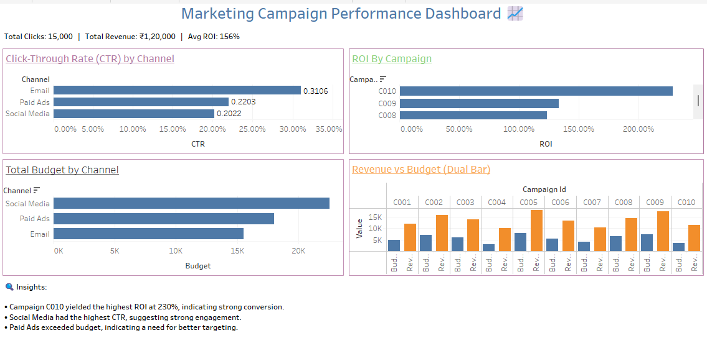

📊 Marketing Campaign Performance Analysis

This project dives into the performance of digital marketing campaigns using a combination of MySQL, Excel, and Tableau. It showcases the full cycle of data analysis  from raw data exploration to final dashboard creation with the goal of uncovering actionable marketing insights.

🛠️ Tools & Technologies
MySQL – Used for writing queries to clean, transform, and analyze campaign data.

Excel – Assisted in preliminary data cleanup and formatting.

Tableau – Built interactive visualizations to interpret marketing KPIs.

📂 Project Files
marketing_campaign.sql – All SQL scripts including schema setup and analysis queries.

marketing_data.xlsx – The structured dataset used for analysis and visualization.

dashboard.twbx – Tableau workbook containing interactive dashboards.

screenshots/ – A preview image of the final dashboard.

🔍 Insights Derived
Campaign C010 achieved the best return on investment, crossing 220%.

Social Media stood out with the highest number of impressions.

Paid Ads showed strong performance in terms of revenue-to-cost efficiency.

🖼️ Dashboard Snapshot

💬 Let’s Connect
Riya Bisht | riiyabisht@gmail.com